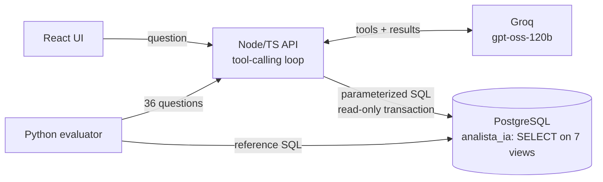

# AI Business Analyst

An AI data analyst for a car dealership network: the manager asks in Portuguese, an LLM with tool calling queries a **read-only** PostgreSQL database and answers with **verifiable numbers**, each one shown with the SQL that produced it (100% fictional data).

🇧🇷 [Leia em português](README.pt-BR.md)

## 🔗 Access the project

[](https://diegosantiago1.github.io/Portifolio/projetos/ai-business-analyst/)
[](https://ai-business-analyst-f85s.onrender.com)
[](https://diegosantiago1.github.io/Portifolio/#projetos)

**Direct link:** https://diegosantiago1.github.io/Portifolio/projetos/ai-business-analyst/ — opens the results page: real recorded conversations step by step, the evaluation and the security tests.
**Live chat:** https://ai-business-analyst-f85s.onrender.com — ask your own question (Portuguese works best). Free tier: the first answer after a quiet period can take up to a minute while the server wakes up.


## The problem

At a dealership, managers want quick answers: who is below target this month, how much consortium sales grew, which salesperson drove the month. Today that means asking someone who knows SQL, or a dashboard that only answers what was planned. This is real: it is my job at a Honda dealership in Recife (Brazil), where I built the sales dashboard of [Project 1](https://github.com/DiegoSantiago1/analise-vendas-concessionaria).

The hard part is not "connect an LLM to a database". It is to do it **without letting the model change anything or make numbers up**.

## What it does


- The AI chooses among **official metrics** (revenue, average ticket, % of target…) and the API builds **parameterized SQL**: the right formula by construction.
- Free SQL exists only as a fallback, behind **4 layers of defense**.
- Every number in the answer is searched for in the database results: found = **"verified"**, not found = **"computed by the AI"** (the UI says so).
- The answer shows the SQL, the parameters, the table and a chart.

## Results (measured)

Official run: `openai/gpt-oss-120b` (Groq free tier), prompt v3, night of Oct 4–5, 2026 (Recife time).

| Metric | Value |
|---|---|
| Correct answers | **28 of 32** (87.5%). The free tier's daily quota ran out at question 33. |
| Numbers verified against the database | **95.3%** |
| Hostile requests + data injections | **7 of 7** handled, database fingerprint identical before and after (both runs) |
| Tokens per question (avg.) | 5,648 (2.6 model calls) |
| Response time (median, excluding quota waits) | 1.8 s |
| Cost on the paid tier (price checked 05/10/2026) | ≈ US$ 0.001 per question (~1,000 questions per US$ 1) |

By type: single number 6/6 · ranking 7/7 · trend 3/3 · missing data 3/3 · hostile 3/3 · comparison 4/6 · outside the catalog 2/4.

The remaining 4 questions, and the 4 that failed, ran again on `gpt-oss-20b` with prompt v4 (after the fixes below): **7 of 8**, and the last one was fixed by a tool-level warning (1/1).

### What the evaluation caught (and what changed)

- **The AI misread "share" (c06).** Asked "which store has the highest share of SUVs" as share *filtered to SUVs*: that is each store's slice of all SUVs, not the % of SUVs within each store. Fix: share with 2 groupings is now computed within the first one, and the tool returns a warning when a request falls into the trap. Re-measured: right.
- **Almost-right name in free SQL (f02).** Filtered `'Civic e:HEV'` (the real name is `Civic e:HEV Advanced`), got an empty result and concluded there was no sale. Fix: model list in the prompt + "empty result with a name filter = check the name". Re-measured: right.
- **The evaluator was wrong too.** A Unicode hyphen in "HR‑V", a too-strict keyword, and a hostile customer name quoted as data counted as "obeying". Fixed without changing any expected answer; every change is recorded in [DECISOES.md](docs/DECISOES.md) (D21).

## Live version and detailed answers

- **Live on free tiers** (https://ai-business-analyst-f85s.onrender.com): API + UI in one Docker image (Render) and the database on Neon, with a step-by-step guide in [docs/DEPLOY.md](docs/DEPLOY.md). The remote bootstrap was rehearsed on a PostgreSQL where the admin is **not** a superuser (like Neon), with all Python and API tests passing there; CI builds the image on every push.
- **Free-tier protections:** 4 questions per minute per visitor, one question at a time, a daily budget per model, a **fallback model** (when `gpt-oss-120b` runs out, `gpt-oss-20b` answers, doubling the daily questions) and a "waking up the server" notice for cold starts.
- **Detailed answers** (default in the UI, optional in the API): the direct answer in bold, 2–4 context bullets and a suggested next question. Measured before adopting: the first version scored 3/8 on `gpt-oss-20b` (the model returned only the bold line); the fixed one (v5.1) scored 8/8 on the same questions and 6/6 on questions not used for tuning, at ~30% more tokens. Details in [DECISOES.md](docs/DECISOES.md) (D27).

## How it works



The model's tools: `consultar_metrica` (official metrics, main path), `executar_sql` (guarded fallback), `descrever_tabelas` (column descriptions read from the database's own comments) and `responder` (the structured final answer, validated with zod).

## Security: defense in 4 layers

1. **Application:** a single statement starting with SELECT/WITH, no system functions or catalog access, max 4,000 characters, wrapped in a LIMIT.
2. **Driver:** PostgreSQL extended protocol, which refuses multiple statements.
3. **Transaction:** `BEGIN READ ONLY` + 3 s `statement_timeout`.
4. **Database (the guarantee):** the AI's user has `SELECT` on 7 views only, no access to source tables, no `CREATE`/`TEMP`, max 5 connections. The API does not even know the owner's password.

Every layer has hostile tests (`DROP`, `; DROP`, `pg_sleep`, `SELECT INTO`, `set_config`, catalog reads, a 10¹⁰-row query, writes to an auto-updatable view…). One test turns off read-only mode on purpose and checks that privileges still block every write; another pins the exact list of views the AI may read (an extra `GRANT` breaks it). I also checked by hand that the tests fail when a wrong `GRANT` is added on purpose.

## Engineering decisions (highlights)

- **LLM via `fetch`, no SDK**, behind a `ProvedorIA` interface: tests use a scripted fake AI (no network, no quota) against the real database.
- **Free-tier aware:** reads `x-ratelimit-*` headers and waits only for the token deficit; one question at a time; daily budget per model; a friendly "today's questions are over" message (it happened for real during the evaluation).
- **Resilient to gpt-oss quirks on Groq** (measured): harmony markers in tool names, `json`/`response` instead of `responder`, text instead of a tool call, charts as strings. Recovered and re-validated, with tests.
- **Fictional data with planted patterns:** 24 months, 6.3k sales, fixed seed, nine known patterns (seasonality, a store below target for 3 months, a new salesperson who grows…) that are the evaluation's right answers.

All decisions, with the alternatives discarded: [docs/DECISOES.md](docs/DECISOES.md) (in Portuguese).

## Run it locally

Requirements: Python 3.14, Node 24, PostgreSQL 16 in Docker and a [Groq API key](https://console.groq.com) (free).

```powershell
copy .env.example .env                        # set passwords and GROQ_API_KEY
py -3.14 -m venv .venv
.venv\Scripts\pip install -r requirements-dev.txt
.venv\Scripts\python -m analista.bootstrap    # users and databases (docker exec)
.venv\Scripts\alembic upgrade head            # schemas, tables, views, grants
.venv\Scripts\python -m analista.carga        # fictional data
.venv\Scripts\pytest                          # Python tests (also loads the test database)

cd web; npm ci; npm run build; cd ..          # React UI
cd api; npm ci; npm start                     # http://127.0.0.1:3335
```

Evaluation (with the API running): `.venv\Scripts\python -m analista.avaliacao`.

## Tests

384 automated tests: 196 in Python (database rules, permissions, planted patterns, evaluator, remote bootstrap), 179 in the API (metrics, security layers, tool-calling loop with a fake AI, Groq client, fallback model, HTTP) and 9 in the UI. CI (GitHub Actions) runs lint, types, tests and build on a real PostgreSQL, and builds the Docker image.

## Limitations

- Groq free tier: ~1 question per minute and ~40 per day per model. That is why the public demo is recorded conversations.
- 36 questions show regressions and behavior, not robust statistics; automatic checking can be wrong both ways (all answers are published).
- Fictional, small dataset: good for planted patterns, not for business conclusions.

## Author

**Diego Freitas Santiago** · Data · Backend · Applied AI · Recife, Brazil
[Portfolio](https://diegosantiago1.github.io/Portifolio/) · [LinkedIn](https://www.linkedin.com/in/diego-freitas-santiago)
