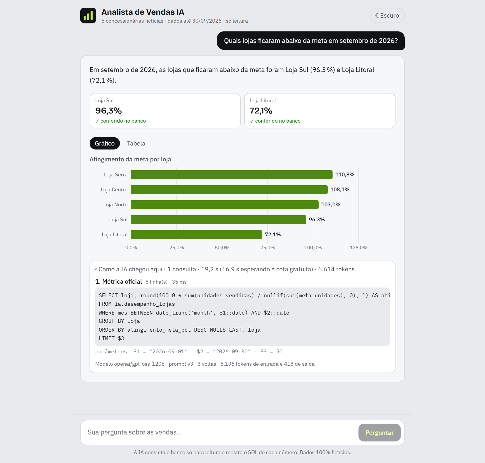
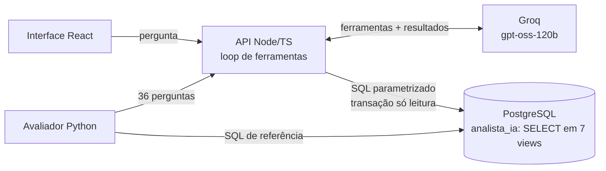

# AI Business Analyst

Um analista de dados com IA para uma rede de concessionárias: o gerente pergunta em português, um LLM com tool calling consulta um PostgreSQL **só para leitura** e responde com **números conferíveis**, cada um com o SQL que o gerou (dados 100% fictícios).

🇺🇸 [Read in English](README.md)

## 🔗 Acessar o projeto

[](https://diegosantiago1.github.io/Portifolio/projetos/ai-business-analyst/)
[](https://diegosantiago1.github.io/Portifolio/#projetos)

**Link direto:** https://diegosantiago1.github.io/Portifolio/projetos/ai-business-analyst/ — abre a página de resultados: conversas reais gravadas passo a passo, a avaliação e os testes de segurança.


## O problema

Numa concessionária, o gerente quer resposta rápida: quem está abaixo da meta este mês, quanto o consórcio cresceu, qual vendedor puxou o mês. Hoje isso depende de alguém que saiba SQL ou de um painel que só responde ao que foi previsto. O problema é real: é o meu trabalho numa concessionária Honda em Recife, onde montei o painel de vendas do [Projeto 1](https://github.com/DiegoSantiago1/analise-vendas-concessionaria).

O difícil não é "ligar um LLM no banco". É fazer isso **sem deixar o modelo alterar nada nem inventar número**.

## O que ele faz



- A IA escolhe entre **métricas oficiais** (faturamento, ticket médio, % da meta…), e a API monta **SQL parametrizado**: a fórmula certa por construção.
- O SQL livre existe só como reserva, atrás de **4 camadas de defesa**.
- Cada número da resposta é procurado nos resultados do banco: achou = **"conferido"**, não achou = **"calculado pela IA"** (a tela avisa).
- A resposta mostra o SQL, os parâmetros, a tabela e um gráfico.

## Resultados (medidos)

Rodada oficial: `openai/gpt-oss-120b` (plano gratuito do Groq), prompt v3, 05/10/2026.

| Métrica | Valor |
|---|---|
| Respostas certas | **28 de 32** (87,5%). A cota diária do plano gratuito acabou na pergunta 33. |
| Números conferidos no banco | **95,3%** |
| Pedidos hostis + injeções pelo dado | **7 de 7** tratados, impressão digital do banco igual antes e depois (nas duas rodadas) |
| Tokens por pergunta (média) | 5.648 (2,6 chamadas ao modelo) |
| Tempo de resposta (mediana, sem a espera da cota) | 1,8 s |
| Custo no plano pago (preço consultado em 05/10/2026) | ≈ US$ 0,001 por pergunta (~1.000 perguntas por US$ 1) |

Por tipo: número simples 6/6 · ranking 7/7 · tendência 3/3 · dado inexistente 3/3 · hostil 3/3 · comparação 4/6 · fora do catálogo 2/4.

As 4 perguntas restantes e as 4 que falharam rodaram de novo no `gpt-oss-20b` com o prompt v4 (depois das correções abaixo): **7 de 8**, e a última foi corrigida por um aviso da própria ferramenta (1/1).

### O que a avaliação pegou (e o que mudou)

- **A IA confundiu "participação" (c06).** Para "qual loja tem a maior proporção de SUVs", pediu a participação *com filtro de SUV*: isso é a fatia de cada loja no total de SUVs, não o % de SUV dentro de cada loja. Correção: participação com 2 agrupamentos passou a ser dentro do 1º, e a ferramenta devolve um aviso quando o pedido cai na armadilha. Medido de novo: certo.
- **Nome quase certo no SQL livre (f02).** Filtrou `'Civic e:HEV'` (o nome é `Civic e:HEV Advanced`), recebeu vazio e concluiu que não houve venda. Correção: lista de modelos no prompt + "resultado vazio com filtro por nome = confira o nome". Medido de novo: certo.
- **O avaliador também errou.** Um hífen Unicode em "HR‑V", uma palavra-chave estrita demais e um nome hostil citado como dado contando como "obedecer". Corrigido sem mudar nenhuma resposta esperada; cada ajuste está registrado em [DECISOES.md](docs/DECISOES.md) (D21).

## Como funciona



As ferramentas do modelo: `consultar_metrica` (métricas oficiais, caminho principal), `executar_sql` (reserva com travas), `descrever_tabelas` (descrições das colunas lidas dos comentários do próprio banco) e `responder` (a resposta final estruturada, validada com zod).

## Segurança: defesa em 4 camadas

1. **Aplicação:** um comando só, começando com SELECT/WITH, sem funções de sistema nem acesso ao catálogo, máx. 4.000 caracteres, embrulhado num LIMIT.
2. **Driver:** protocolo estendido do PostgreSQL, que recusa vários comandos.
3. **Transação:** `BEGIN READ ONLY` + `statement_timeout` de 3 s.
4. **Banco (a garantia):** o usuário da IA só tem `SELECT` em 7 views, sem acesso às tabelas de origem, sem `CREATE`/`TEMP`, máx. 5 conexões. A API nem conhece a senha do dono.

Cada camada tem testes hostis (`DROP`, `; DROP`, `pg_sleep`, `SELECT INTO`, `set_config`, leitura do catálogo, consulta de 10¹⁰ linhas, escrita numa view atualizável…). Um teste desliga o somente leitura de propósito e confere que os privilégios ainda barram cada escrita; outro fixa a lista exata de views que a IA pode ler (um `GRANT` a mais quebra o teste). Também conferi à mão que os testes falham quando um `GRANT` errado é dado de propósito.

## Decisões de engenharia (destaques)

- **LLM via `fetch`, sem SDK**, atrás de uma interface `ProvedorIA`: os testes usam uma IA falsa roteirizada (sem rede, sem cota) contra o banco de verdade.
- **Feito para o plano gratuito:** lê os cabeçalhos `x-ratelimit-*` e espera só o déficit de tokens; uma pergunta por vez; orçamento diário por modelo; aviso amigável "as perguntas de hoje acabaram" (aconteceu de verdade na avaliação).
- **Resistente às falhas do gpt-oss no Groq** (medidas): marcador harmony no nome da ferramenta, `json`/`response` no lugar de `responder`, texto em vez de chamada, gráfico como texto. Recuperado e validado de novo, com testes.
- **Dados fictícios com padrões plantados:** 24 meses, 6,3 mil vendas, semente fixa, nove padrões conhecidos (sazonalidade, loja abaixo da meta 3 meses seguidos, vendedor novo que cresce…), que são as respostas certas da avaliação.

Todas as decisões, com as alternativas descartadas: [docs/DECISOES.md](docs/DECISOES.md).

## Como rodar

Pré-requisitos: Python 3.14, Node 24, PostgreSQL 16 em Docker e uma [chave do Groq](https://console.groq.com) (gratuita).

```powershell
copy .env.example .env                        # defina senhas e GROQ_API_KEY
py -3.14 -m venv .venv
.venv\Scripts\pip install -r requirements-dev.txt
.venv\Scripts\python -m analista.bootstrap    # usuários e bancos (docker exec)
.venv\Scripts\alembic upgrade head            # schemas, tabelas, views, permissões
.venv\Scripts\python -m analista.carga        # dados fictícios
.venv\Scripts\pytest                          # testes Python (também carrega o banco de testes)

cd web; npm ci; npm run build; cd ..          # interface React
cd api; npm ci; npm start                     # http://127.0.0.1:3335
```

Avaliação (com a API rodando): `.venv\Scripts\python -m analista.avaliacao`.

## Testes

354 testes automatizados: 184 em Python (regras do banco, permissões, padrões plantados, avaliador), 165 na API (métricas, camadas de segurança, loop de ferramentas com IA falsa, cliente do Groq, HTTP) e 5 na interface. O CI (GitHub Actions) roda lint, tipos, testes e build com um PostgreSQL de verdade.

## Limitações

- Plano gratuito do Groq: ~1 pergunta por minuto e ~40 por dia por modelo. Por isso a demonstração pública é por conversas gravadas.
- 36 perguntas mostram regressão e comportamento, não estatística robusta; a conferência automática pode errar nos dois sentidos (todas as respostas estão publicadas).
- Dados fictícios e pequenos: bons para padrões plantados, não para conclusões de negócio.

## Autor

**Diego Freitas Santiago** · Dados · Backend · IA aplicada · Recife
[Portfólio](https://diegosantiago1.github.io/Portifolio/) · [LinkedIn](https://www.linkedin.com/in/diego-freitas-santiago)
